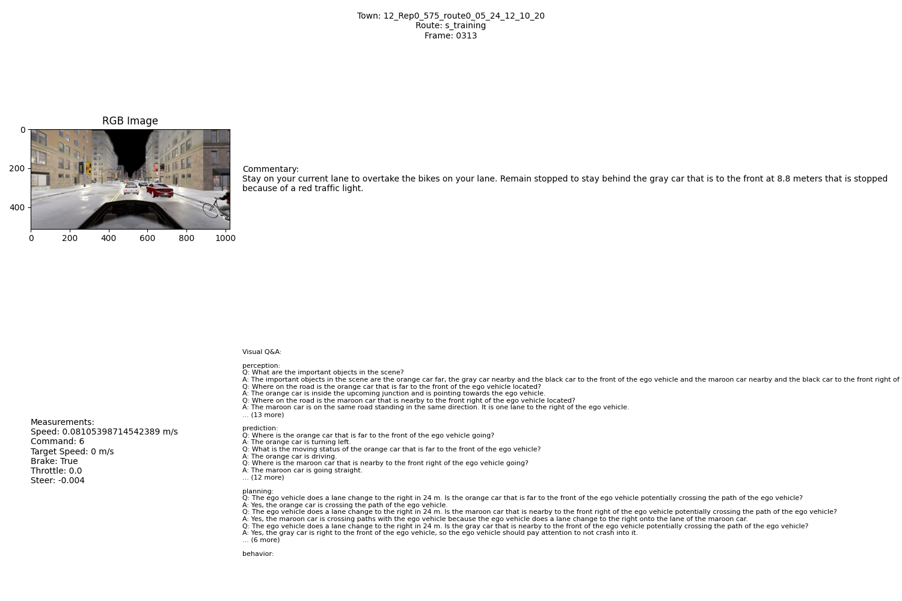
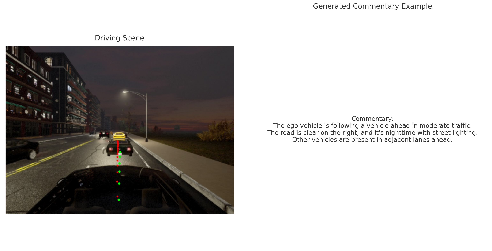
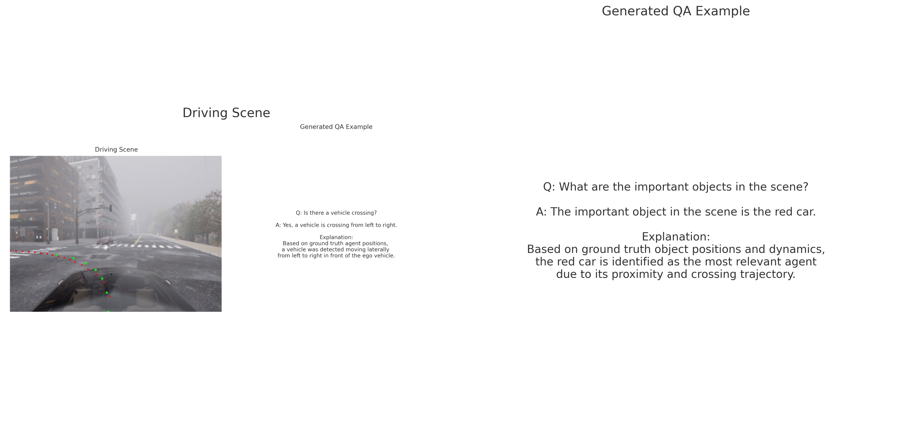
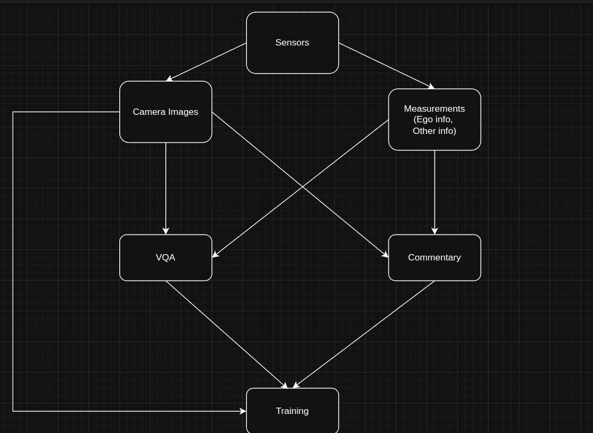

# SimLingo: Vision-Only Closed-Loop Autonomous Driving with Language-Action Alignment

This repository is a fork of the original [SimLingo repository](https://github.com/RenzKa/simlingo) by Katrin Renz et al., modified to run data collection and processing locally without SLURM dependencies. The main purpose of this fork is to provide a simplified workflow for understanding Vision-Language-Action (VLA) alignment in autonomous driving using the CARLA simulator.

_Note: This repository focuses on the data collection and processing pipeline of SimLingo VLA. It does not include the full training/inference pipeline, as training large-scale autonomous driving models typically requires significant computational resources beyond a single GPU setup. For the complete training pipeline and model implementation, please refer to the [original repository](https://github.com/RenzKa/simlingo)._

## Prerequisites


## Setup and Installation

### 1. CARLA Setup
Clone the repository, setup CARLA 0.9.15, and build the conda environment:
```Shell
git clone git@github.com:RenzKa/simlingo.git
cd simlingo
chmod +x setup_carla.sh
./setup_carla.sh
```

Before running the code, you will need to add the following paths to PYTHONPATH on your system:
```Shell
export CARLA_ROOT=/path/to/CARLA/root
export WORK_DIR=/path/to/simlingo
export PYTHONPATH=$PYTHONPATH:${CARLA_ROOT}/PythonAPI/carla
export SCENARIO_RUNNER_ROOT=${WORK_DIR}/scenario_runner
export LEADERBOARD_ROOT=${WORK_DIR}/leaderboard
export PYTHONPATH="${CARLA_ROOT}/PythonAPI/carla/":"${SCENARIO_RUNNER_ROOT}":"${LEADERBOARD_ROOT}":${PYTHONPATH}
```

### 2. Environment Setup

1. Create and activate a new conda environment:
   ```bash
   conda create -n simlingo python=3.8
   conda activate simlingo
   ```

2. Install PyTorch with CUDA support. Follow the [official link](https://pytorch.org/get-started/locally/).

3. (Have torch installed before running this step) Clone the repository:
   ```bash
   git clone [repository-url]
   cd simlingo
   ```

4. Install dependencies:
   ```bash
   pip install -r requirements.txt
   ```

## Data Collection

If you want to download already generated by the Authors, follow [this](https://github.com/RenzKa/simlingo?tab=readme-ov-file#dataset-download).

Run the local data collection script:
```bash
python collect_dataset_local.py
```

The script will:
- Initialize CARLA simulation
- Process predefined routes and scenarios
- Collect sensor data, measurements, and route information
- Save data in the specified output directory

### Data Structure

Collected data will be saved in:
```
database/simlingo_v2_[date]/
├── raw_data/
│   ├── measurements/
│   ├── sensor_data/
│   └── route_info/
```

## Language Data Generation

After collecting the raw driving data, you can generate language labels:

### 1. VQA Generation

```bash
python dataset_generation/language_labels/generate_vqa.py
```

Generated VQA data will be saved in:
```
database/simlingo_v2_[date]/drivelmTD/
```

### 2. Commentary Generation

```bash
python dataset_generation/language_labels/generate_commentary.py
```

Generated commentary will be saved in:
```
database/simlingo_v2_[date]/commentary/
```

### 3. GPT Augmentation

To augment the language data using GPT-4:

```bash
python dataset_generation/get_augmentations/gpt_augment_vqa.py
```

### 4. Bucket Generation

To generate data buckets:
```bash
python dataset_generation/bucket_generation/generate_buckets.py
```

### 5. Data Visualization

To visualize a single data point with all its associated information (RGB image, measurements, commentary, and VQA data), use the provided visualization script:

```bash
python simple_data_viewer.py
```

This will display a comprehensive view of a sample data point including:
- RGB camera image
- Vehicle measurements (speed, steering, etc.)
- Generated commentary
- Visual Question-Answering (VQA) pairs



### 6. Data Generation Explanation

The authors generate question-answer pairs and commentary directly from simulation ground truth. The driving simulator provides full access to ego vehicle state, nearby agents, traffic lights, and map elements. Using these signals, rule-based templates automatically convert the scene into natural language. 

Directly generating the language instructions using a VLM fails. Ensuring the accuracy of the generated data becomes an issue. Check the commentary generation example below. It was generated without any ground truth measurements. The commentary says that the road on the right is clear, but we can see that on the right is the sidewalk. 



For question-answer pairs (see Figure below), specific world states are mapped to questions such as `What are the important objects in the scene?`, with answers like `The important object in the scene is the red car.`, based on the position and motion of surrounding agents. The wrongly generated QA without the ground truth was `Is there a vehicle crossing?` and `Yes, a vehicle is crossing from left to right`, which can be seen in the middle captions below.



The data generation pipeline is shown below:



For commentary generation, multiple ground truth elements are combined into richer scene descriptions. This allows the creation of detailed, aligned video-language datasets at scale without manual labeling.


## Citations

SimLingo:
```BibTeX
@InProceedings{Renz2025cvpr,
  title={SimLingo: Vision-Only Closed-Loop Autonomous Driving with Language-Action Alignment},
  author={Renz, Katrin and Chen, Long and Arani, Elahe and Sinavski, Oleg},
  booktitle={Conference on Computer Vision and Pattern Recognition (CVPR)},
  year={2025}
}
```

PDM-Lite expert:
```BibTeX
@inproceedings{Sima2024ECCV,
  title={DriveLM: Driving with Graph Visual Question Answering},
  author={Chonghao Sima and Katrin Renz and Kashyap Chitta and Li Chen and Hanxue Zhang and Chengen Xie and Jens Beißwenger and Ping Luo and Andreas Geiger and Hongyang Li},
  booktitle={Proc. of the European Conf. on Computer Vision (ECCV)},
  year={2024}
}
```

Bench2Drive benchmark:

```BibTeX
@inproceedings{Jia2024NeurIPS,
  title={Bench2Drive: Towards Multi-Ability Benchmarking of Closed-Loop End-To-End Autonomous Driving},
  author={Xiaosong Jia and Zhenjie Yang and Qifeng Li and Zhiyuan Zhang and Junchi Yan},
  booktitle={NeurIPS 2024 Datasets and Benchmarks Track},
  year={2024}
}
```

SmolVLM2

```BibTeX
@misc{marafioti2025smolvlmredefiningsmallefficient,
      title={SmolVLM: Redefining small and efficient multimodal models}, 
      author={Andrés Marafioti and Orr Zohar and Miquel Farré and Merve Noyan and Elie Bakouch and Pedro Cuenca and Cyril Zakka and Loubna Ben Allal and Anton Lozhkov and Nouamane Tazi and Vaibhav Srivastav and Joshua Lochner and Hugo Larcher and Mathieu Morlon and Lewis Tunstall and Leandro von Werra and Thomas Wolf},
      year={2025},
      eprint={2504.05299},
      archivePrefix={arXiv},
      primaryClass={cs.AI},
      url={https://arxiv.org/abs/2504.05299}, 
}
```

## License

This project is licensed under the [MIT License](LICENSE). 